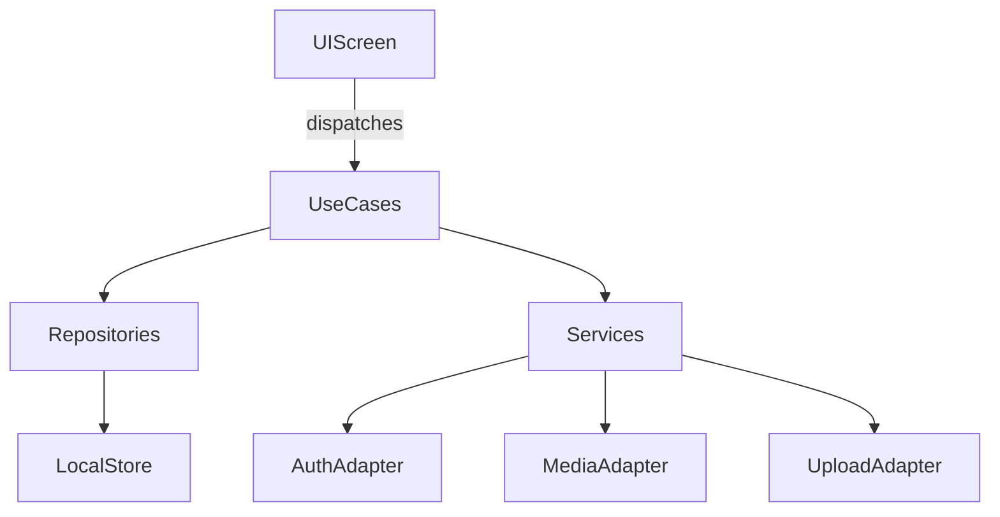

# iOS Video Scheduler Plan

## Goals

- iOS-first React Native (Expo) app for scheduling and uploading videos to TikTok/Instagram/YouTube.
- Local-only scheduling and queueing now, with interfaces and data model prepared for a future backend.

## Proposed Architecture

- **Presentation**: Expo Router screens and typed navigation.
- **Domain**: Interfaces for auth, scheduler, media storage, and uploader.
- **Data**: Local persistence via AsyncStorage (or SQLite if needed later), with sync-ready entity shapes.

## Data Model (sync-ready)

- `AccountLink`: platform, authState, tokens (stored securely), status
- `MediaItem`: id, localUri, remoteUri, checksum, duration, thumbnailUri, availabilityState
- `ScheduleItem`: id, mediaId, platform, scheduledAt, status, lastAttemptAt
- `UploadJob`: id, scheduleId, platform, payload (title, desc, hashtags)

## Key App Flows

- **Account linking**: OAuth flow abstraction; store tokens in secure storage.
- **Backlog**: list of `MediaItem` + `ScheduleItem` per platform.
- **Scheduler**: local queue + optional local notifications to simulate schedule trigger.
- **Upload**: stubbed service that validates permissions and media availability.

## Files to Create/Update

- Update entry: [`/Users/Doug/Library/Mobile Documents/com~apple~CloudDocs/Development/ai-dev/schdup/App.tsx`](./App.tsx)
- App scaffold: add Expo Router structure under [`/Users/Doug/Library/Mobile Documents/com~apple~CloudDocs/Development/ai-dev/schdup/app`](./app)
- Domain interfaces: [`/Users/Doug/Library/Mobile Documents/com~apple~CloudDocs/Development/ai-dev/schdup/src/domain`](./src/domain)
- Local persistence + adapters: [`/Users/Doug/Library/Mobile Documents/com~apple~CloudDocs/Development/ai-dev/schdup/src/data`](./src/data)
- UI components: [`/Users/Doug/Library/Mobile Documents/com~apple~CloudDocs/Development/ai-dev/schdup/components`](./components)

## Implementation Steps

1. **Set up Expo Router** and basic screen layout: Backlog, Schedule, Capture, Accounts, Settings.
2. **Define sync-ready models** and repository interfaces in `src/domain`.
3. **Build local adapters** using AsyncStorage + SecureStore for tokens; stub upload service.
4. **Implement backlog list** and schedule creation flow (date picker, hashtags/title).
5. **Add media capture/import** via camera and photo library.
6. **Scheduler simulation** using local notifications; job status updates in local store.

## Notes

- iOS-only means we can use iOS-specific permissions now; keep abstractions in place for later Android.
- Upload service remains a stub with mock responses; actual platform upload APIs can replace later.